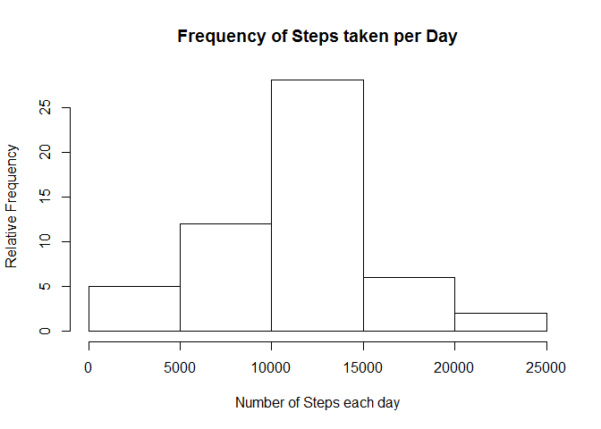
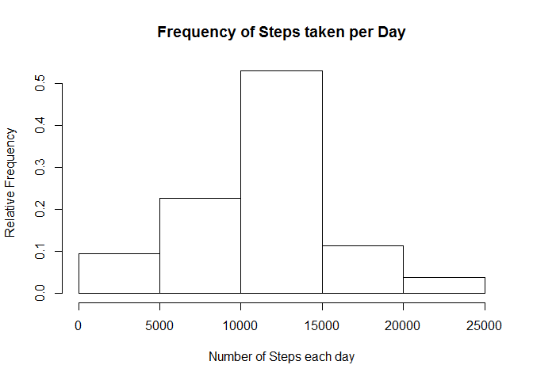
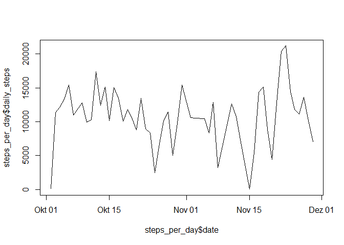
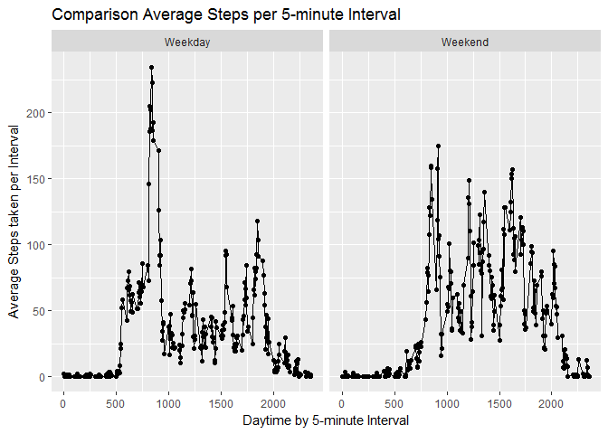

# Reproducible Research: Peer Assessment 1


## Loading and preprocessing the data

```r
library(readr)
p <- unzip("activity.zip", files = "activity.csv")
df <- read_csv(p)
```

```
## Parsed with column specification:
## cols(
##   steps = col_integer(),
##   date = col_date(format = ""),
##   interval = col_integer()
## )
```

```r
rm(p)

library(dplyr)
```

```
## 
## Attaching package: 'dplyr'
```

```
## The following objects are masked from 'package:stats':
## 
##     filter, lag
```

```
## The following objects are masked from 'package:base':
## 
##     intersect, setdiff, setequal, union
```

```r
df <- df %>%
        filter(!(is.na(steps)))
```

## What is mean total number of steps taken per day?

```r
#Plot for Distribution of taken steps a day
steps_per_day <- df %>%
        group_by(date) %>%
        summarise(daily_steps = sum(steps))

h <- hist(steps_per_day$daily_steps,
          main = "Frequency of Steps taken per Day",
          ylab = "Relative Frequency",
          xlab = "Number of Steps each day")
```

<!-- -->

```r
h$density = h$counts/sum(h$counts)
```

```r
plot(h,
     freq=FALSE,
     main = "Frequency of Steps taken per Day",
     ylab = "Relative Frequency",
     xlab = "Number of Steps each day")
```

<!-- -->

```r
#Mean and median number of steps taken each day
mean(steps_per_day$daily_steps)
```

```
## [1] 10766.19
```

```r
median(steps_per_day$daily_steps)
```

```
## [1] 10765
```


## What is the average daily activity pattern?


```r
plot(x = steps_per_day$date, 
     y = steps_per_day$daily_steps, 
     type = "l")
```

<!-- -->

```r
interval_max_steps <- df %>%
        group_by(interval) %>%
        summarise(max_steps_interval = sum(steps)) %>%
        arrange(desc(max_steps_interval))

#The 5-minute interval that, on average, contains the maximum number of steps
print(interval_max_steps[1,])
```

```
## # A tibble: 1 x 2
##   interval max_steps_interval
##      <int>              <int>
## 1      835              10927
```

## Imputing missing values

```r
df1 <- df
df1$steps[is.na(df1$steps)] <- mean(df$steps) #Further Taken

#2. Strategy: Replace missing values (NA) with the median of the variable
df2 <- df
df2$steps[is.na(df2$steps)] <- median(df$steps)

#Task: Histogram of the total number of steps taken each day after missing values are imputed
steps_per_day1 <- df1 %>%
        group_by(date) %>%
        summarise(daily_steps = sum(steps))

h1 <- hist(steps_per_day1$daily_steps,
          main = "Frequency of Steps taken per Day",
          ylab = "Relative Frequency",
          xlab = "Number of Steps each day")
```

<!-- -->

```r
h1$density = h1$counts/sum(h1$counts)
plot(h1,
     freq=FALSE,
     main = "Frequency of Steps taken per Day",
     ylab = "Relative Frequency",
     xlab = "Number of Steps each day")
```

<!-- -->


## Are there differences in activity patterns between weekdays and weekends?

```r
df3 <- df1 %>%
        mutate(weekdays = weekdays(date, abbreviate = FALSE)) %>%
        mutate(weekend = if_else(weekdays %in% c("Samstag", "Sonntag"), 
                                 TRUE, FALSE)) %>%
        mutate(weekdays = if_else(weekdays %in% c("Montag", "Dienstag", "Mittwoch", "Donnerstag", "Freitag"), 
                                 TRUE, FALSE)) %>%
        mutate(Day = if_else(weekdays == TRUE, "Weekday", "Weekend")) %>%
        select(1,2,3,6) %>%
        group_by(Day, interval) %>%
        summarise(steps_avrg = mean(steps))

library(ggplot2)
g <- qplot(x = interval, y = steps_avrg, data=df3, facets = . ~ Day) +
        geom_line() +
        labs(x = "Daytime by 5-minute Interval",
             y = "Average Steps taken per Interval",
             title = "Comparison Average Steps per 5-minute Interval"); g
```

<!-- -->
